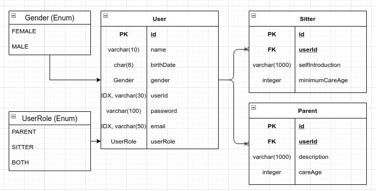
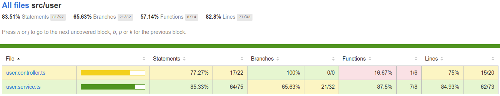

# Mamsitter with nest.js

## 전체 구조

### 사용한 라이브러리
nest.js(web framework), typeorm, passport, jwt, bcrypt, class-validator, jest


### Architecture
3-tier Architecture : controller -> service -> repository

### Package 설명
#### src/dto: 사용자 request 객체
 - 각각의 dto는 유저 요청에 대해 유효성을 검증하는 로직이 포함되어 있음
 - class-validator 를 사용

#### src/entity: db 객체

#### src/payload: 사용자 response 객체

#### src/user
signUp, signIn, user (GET /user), become (부모, 시터 되기), updateUser 함수를 포함

#### src/auth
id-password 인증 및 jwt validation 로직을 포함

`auth.module.ts`에서 `Passport, LocalStrategy, JwtStrategy` 를 선언. \
인증 전략은 컨트롤러에 선언된 `@Decorator`에 따라 선택됨.
```typescript
  // 토큰 인증
  @UseGuards(JwtAuthGuard)
  @Get('/:userId')
  getUser(@Param('userId') userId: string): Promise<UserPayload> {
    return this.userService.user(userId);
  }
```

```typescript
  // 로그인에서는 id-password(LocalStrategy) 사용
  @UseGuards(AuthGuard('local'))
  @Post('/signin')
  signIn(@Body() signInDto: SignInDto): Promise<AccessTokenPayload> {
    return this.userService.signIn(signInDto);
  }
```

로그인 성공 후 JWT 반환
```json
custom jwt claims
{
   sub: user.userId,
   role: user.userRole
}
```


## 실행방법
mysql db에 직접 `mamsitter` 테이블을 만든 뒤 아래 명령을 한번에 실행 \
`npm install && npm run typeorm migration:run &&  jest && npm run start`

## 산출물
1. [Apiary (api 스펙 문서)](https://app.apiary.io/mamsitter/) \
apply.momsitter@mfort.co.kr, rednebula@mfort.co.kr 두명에게 read 권한 추가했습니다. 
2. [Github Repository](https://github.com/moltak/nest-js-practice-mam)

## 부연 설명
1. Migration files (/migrations) \
Typeorm 의 CLI를 이용하여 table을 생성하고 foreign-key 및 index 를 생성

2. ERD \
 \
Sitter와 Parent를 User에 종속되게 DB 설계. User는 PARENT, SITTER, BOTH가 될 수 있으며 각각의 정보는 테이블을 참조해서 획득.

3. Test Code \
`src/user/user.service.spec.ts` 에 signIn, signUp 과 유저가 시터, 부모, 시터+부모가 되는 등의 비즈니스 로직 테스트 코드가 추가되어 있음.
 
